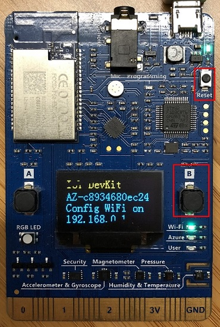
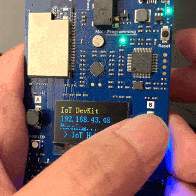
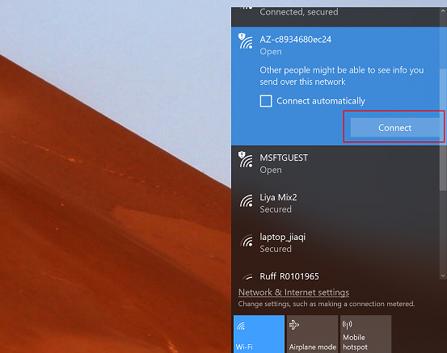
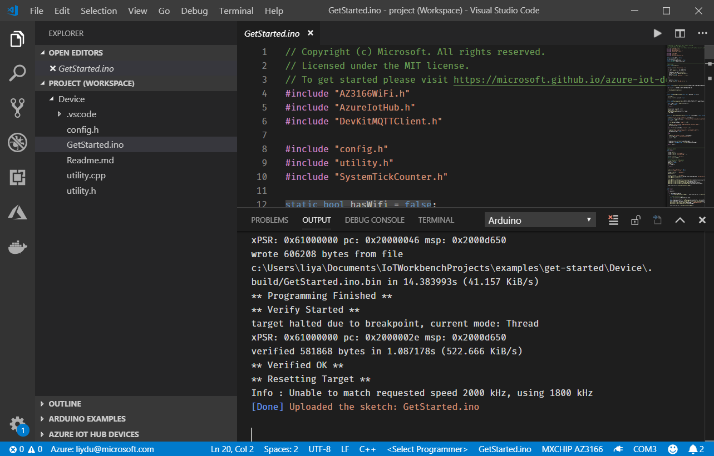

## What you need

* A MXChip IoT DevKit board with a Micro-USB cable. [Get it now](https://aka.ms/iot-devkit-purchase).
* A computer running Windows 10, macOS 10.10+ or Ubuntu 18.04+.
* An active Azure subscription. [Activate a free 30-day trial Microsoft Azure account](https://azureinfo.microsoft.com/us-freetrial.html).

## Prepare your hardware

Hook up the following hardware to your computer:

* DevKit board
* Micro-USB cable


To connect the DevKit to your computer, follow these steps:

1. Connect the USB end to your computer.

2. Connect the Micro-USB end to the DevKit.

3. The green LED for power confirms the connection.

   

### Register a device

Log in on [the frontend website](https://pandemicsafetysuite.azurewebsites.net) and click the large **+** to find the add device screen.

    
    
After filling in the name and type of the device, and submitting, this will return a device connection string for your new device. Make note of this as it will be required later.

### Send DevKit telemetry

The DevKit connects to a device-specific endpoint on your IoT hub and sends temperature and humidity telemetry.

1. Download the latest version of [GetStarted firmware](https://aka.ms/devkit/prod/getstarted/latest) for IoT DevKit.

2. Make sure IoT DevKit connect to your computer via USB. Open File Explorer there is a USB mass storage device called **AZ3166**.

    

3. Drag and drop the firmware just downloaded into the mass storage device and it will flash automatically.

    

4. On the DevKit, Hold down button **B**, push and release the **Reset** button, and then release button **B**. Your DevKit enters AP mode. To confirm, the screen displays the service set identifier (SSID) of the DevKit and the configuration portal IP address.

    

    

5. Use a Web browser on a different Wi-Fi enabled device (computer or mobile phone) to connect to the IoT DevKit SSID displayed in the previous step. If it asks for a password, leave it empty.

    

6. Open **192.168.0.1** in the browser. Select the Wi-Fi that you want the IoT DevKit connect to, type the Wi-Fi password, then paste the device connection string you made note of previously. Then click Save.

    

    > **[NOTE]
    > The IoT DevKit only supports 2.4GHz network. Check [FAQ](https://microsoft.github.io/azure-iot-developer-kit/docs/faq/#wi-fi-configuration) for more details.**

7. The WiFi information and device connection string will be stored into the IoT DevKit when you see the result page.

    

    > **[NOTE]
    > After Wi-Fi is configured, your credentials will persist on the device for that connection, even if the device is unplugged.**

8. The IoT DevKit reboots in a few seconds. On the DevKit screen, you see the IP address for the DevKit follows by the telemetry data including temperature and humidity value with message count send to Azure IoT Hub.

    

    


## Prepare the development environment

Follow these steps to prepare the development environment for the DevKit:

### Install Visual Studio Code with Azure IoT Tools extension package

1. Install [Arduino IDE](https://www.arduino.cc/en/Main/Software). It provides the necessary toolchain for compiling and uploading Arduino code.
    * **Windows**: Use Windows Installer version. Do not install from the App Store.
    * **macOS**: Drag and drop the extracted **Arduino.app** into `/Applications` folder.
    * **Ubuntu**: Unzip it into folder such as `$HOME/Downloads/arduino-1.8.8`

2. Install [Visual Studio Code](https://code.visualstudio.com/), a cross platform source code editor with powerful intellisense, code completion and debugging support as well as rich extensions can be installed from marketplace.

3. Launch VS Code, look for **Arduino** in the extension marketplace and install it. This extension provides enhanced experiences for developing on Arduino platform.

    

4. Look for [Azure IoT Tools](https://aka.ms/azure-iot-tools) in the extension marketplace and install it.

    

    > **[NOTE]
    > The Azure IoT Tools extension pack contains the [Azure IoT Device Workbench](https://aka.ms/iot-workbench) which is used to develop and debug on various IoT devkit devices. The [Azure IoT Hub Toolkit](https://aka.ms/iot-toolkit), also included with the Azure IoT Tools extension pack, is used to manage and interact with Azure IoT Hubs.**

5. Configure VS Code with Arduino settings.

    In Visual Studio Code, click **File > Preference > Settings**. Then click the **...** and **Open settings.json**.

    

    Add following lines to configure Arduino depending on your platform: 

    * **Windows**:

        ```json
        "arduino.path": "C:\\Program Files (x86)\\Arduino",
        "arduino.additionalUrls": "https://raw.githubusercontent.com/VSChina/azureiotdevkit_tools/master/package_azureboard_index.json"
        ```

    * **macOS**:

        ```json
        "arduino.path": "/Applications",
        "arduino.additionalUrls": "https://raw.githubusercontent.com/VSChina/azureiotdevkit_tools/master/package_azureboard_index.json"
        ```

    * **Ubuntu**:

        Replace the **{username}** placeholder below with your username.

        ```json
        "arduino.path": "/home/{username}/Downloads/arduino-1.8.8",
        "arduino.additionalUrls": "https://raw.githubusercontent.com/VSChina/azureiotdevkit_tools/master/package_azureboard_index.json"
        ```

6. Click `F1` to open the command palette, type and select **Arduino: Board Manager**. Search for **AZ3166** and install the latest version.

    

### Install ST-Link drivers

[ST-Link/V2](https://www.st.com/en/development-tools/st-link-v2.html) is the USB interface that IoT DevKit uses to communicate with your development machine. You need to install it on Windows to flash the compiled device code to the DevKit. Follow the OS-specific steps to allow the machine access to your device.

* **Windows**: Download and install USB driver from [STMicroelectronics website](https://www.st.com/en/development-tools/stsw-link009.html).
* **macOS**: No driver is required for macOS.
* **Ubuntu**: Run the commands in terminal and sign out and sign in for the group change to take effect:

    ```bash
    # Copy the default rules. This grants permission to the group 'plugdev'
    sudo cp ~/.arduino15/packages/AZ3166/tools/openocd/0.10.0/linux/contrib/60-openocd.rules /etc/udev/rules.d/
    sudo udevadm control --reload-rules

    # Add yourself to the group 'plugdev'
    # Logout and log back in for the group to take effect
    sudo usermod -a -G plugdev $(whoami)
    ```

Now you are all set with preparing and configuring your development environment. Let us build the GetStarted sample you just ran.

## Build your first project

Download the `Device` folder from the repository and open it in VSCode.


### Provision Azure IoT Hub and device

Instead of provisioning Azure IoT Hub and device from the Azure portal, you can do it in the VS Code without leaving the development environment.

1. In the new opened project window, click `F1` to open the command palette, type and select **Azure IoT Device Workbench: Provision Azure Services...**. Follow the step by step guide to finish provisioning your Azure IoT Hub and creating the IoT Hub device.

    

    > **[NOTE]
    > If you have not signed in Azure. Follow the pop-up notification for signing in.**

2. Select the subscription you want to use.

    

3. Then select or create a new [resource group](https://docs.microsoft.com/azure/azure-resource-manager/resource-group-overview#terminology).

    

4. In the resource group you specified, follow the guide to select or create a new Azure IoT Hub.

    

    

    

5. In the output window, you will see the Azure IoT Hub provisioned.

    

6. Select or create a new device in Azure IoT Hub you provisioned.

    

    

7. Now you have Azure IoT Hub provisioned and device created in it. Also the device connection string will be saved in VS Code for configuring the IoT DevKit later.

    

### Configure and compile device code

1. In the bottom-right status bar, check the **MXCHIP AZ3166** is shown as selected board and serial port with **STMicroelectronics** is used.

    

2. Click `F1` to open the command palette, type and select **Azure IoT Device Workbench: Configure Device Settings...**, then select **Config Device Connection String > Select IoT Hub Device Connection String**.

3. On DevKit, hold down **button A**, push and release the **reset** button, and then release **button A**. Your DevKit enters configuration mode and saves the connection string.

    

4. Click `F1` again, type and select **Azure IoT Device Workbench: Upload Device Code**. It starts compile and upload the code to DevKit.

    

The DevKit reboots and starts running the code.

> **[NOTE]
> If there is any errors or interruptions, you can always recover by running the command again.**
